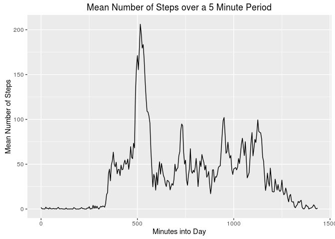
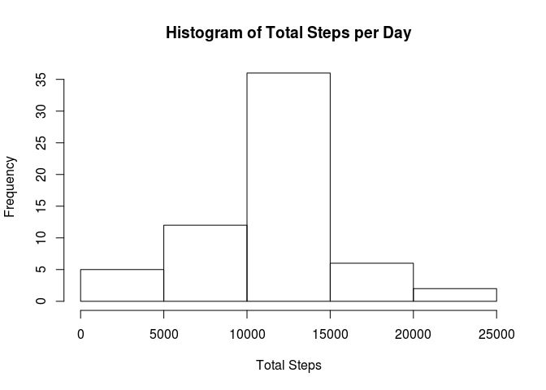
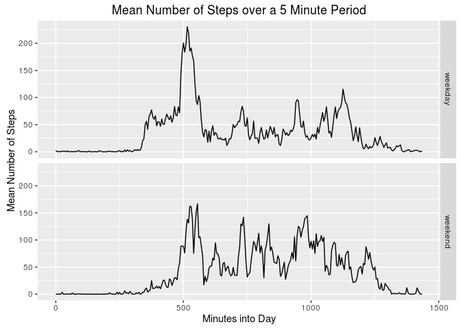

# Reproducible Research: Peer Assessment 1

## Loading and preprocessing the data
Show any code that is needed to:  
  
1. Load the data (i.e. read.csv())  
2. Process/transform the data (if necessary) into a format suitable for your analysis  

```r
library(dplyr)
library(lubridate)
library(stringr)
library(ggplot2)

### 1 ###
# read the data
data <- read.csv(unz('activity.zip', 'activity.csv'))

### 2 ###
# convert the date to a date format
data$date <- ymd(data$date)

# modify the interval column to represent "number of minutes elapsed so far today"
# this is required to correct the scale since the least significant digits range 0-59 instead of 0-99
# a time variable is added to help with interpretability (I couldn't figure out a good way to use it directly)
data$interval <- str_pad(data$interval, 4, pad = "0")
data$time <- paste0(substr(data$interval, 1, 2), ':', substr(data$interval, 3, 4))
data$interval <- as.numeric(substr(data$interval, 1, 2)) * 60 + as.numeric(substr(data$interval, 3, 4))
```


## What is mean total number of steps taken per day?
For this part of the assignment, you can ignore the missing values in the dataset.  
  
1. Calculate the total number of steps taken per day  
2. If you do not understand the difference between a histogram and a barplot, research the difference between them. Make a histogram of the total number of steps taken each day  
3. Calculate and report the mean and median of the total number of steps taken per day  

```r
### 1 ###
StepsPerDay <- data %>%
    group_by(date) %>%
    summarize(total_steps = sum(steps, na.rm = TRUE))

### 2 ###
hist(StepsPerDay$total_steps, main = 'Histogram of Total Steps per Day', xlab = 'Total Steps')
```

<!-- -->

```r
### 3 ###
summary(StepsPerDay$total_steps)
```

```
##    Min. 1st Qu.  Median    Mean 3rd Qu.    Max. 
##       0    6778   10400    9354   12810   21190
```
The mean total steps per day can be seen above as: **9354**


## What is the average daily activity pattern?
1. Make a time series plot (i.e. type = "l") of the 5-minute interval (x-axis) and the average number of steps taken, averaged across all days (y-axis)  
2. Which 5-minute interval, on average across all the days in the dataset, contains the maximum number of steps?  

```r
### 1 ###
StepsPerTime <- data %>%
    group_by(interval, time) %>%
    summarize(mean_steps = mean(steps, na.rm = TRUE))

ggplot(data = StepsPerTime, aes(x = interval, y = mean_steps)) +
    geom_line() +
    labs(title = 'Mean Number of Steps over a 5 Minute Period', x = 'Minutes into Day', y = 'Mean Number of Steps')
```

<!-- -->

```r
### 2 ###
subset(StepsPerTime, mean_steps == max(StepsPerTime$mean_steps, na.rm = TRUE))
```

```
## Source: local data frame [1 x 3]
## Groups: interval [1]
## 
##   interval  time mean_steps
##      (dbl) (chr)      (dbl)
## 1      515 08:35   206.1698
```
It can be seen above that there is a peak of activity in the morning, with highest activity found at **08:35** (24 hour time format).

## Imputing missing values
Note that there are a number of days/intervals where there are missing values (coded as NA). The presence of missing days may introduce bias into some calculations or summaries of the data.  
  
1. Calculate and report the total number of missing values in the dataset (i.e. the total number of rows with NAs)  
2. Devise a strategy for filling in all of the missing values in the dataset. The strategy does not need to be sophisticated. For example, you could use the mean/median for that day, or the mean for that 5-minute interval, etc.  
3. Create a new dataset that is equal to the original dataset but with the missing data filled in.  
4. Make a histogram of the total number of steps taken each day and Calculate and report the mean and median total number of steps taken per day. Do these values differ from the estimates from the first part of the assignment? What is the impact of imputing missing data on the estimates of the total daily number of steps?  


```r
### 1 ###
sum(is.na(data$steps))
```

```
## [1] 2304
```

```r
mean(is.na(data$steps))
```

```
## [1] 0.1311475
```

```r
### 2 ###
# my strategy for imputation is to replace a missing value with the average from that interval
# this average is already calculated previously in the StepsPerTime data frame
data_impute <- data %>%
    merge(StepsPerTime) %>%
    mutate(steps = ifelse(is.na(steps), mean_steps, steps)) %>%
    select(steps, date, interval, time)

### 3 ###
StepsPerDay_impute <- data_impute %>%
    group_by(date) %>%
    summarize(total_steps = sum(steps, na.rm = TRUE))

### 4 ###
hist(StepsPerDay_impute$total_steps, main = 'Histogram of Total Steps per Day', xlab = 'Total Steps')
```

<!-- -->

```r
summary(StepsPerDay_impute$total_steps)
```

```
##    Min. 1st Qu.  Median    Mean 3rd Qu.    Max. 
##      41    9819   10770   10770   12810   21190
```

The new histogram shows shifting of the data towards higher daily total step counts. This is to be expected since each day's step count should be greater than or equal to the pre-imputation amount. Evidence of this increase can be seen with the new mean of **10770** and new median of **10770**, both of which are higher than the pre-imputation values.

## Are there differences in activity patterns between weekdays and weekends?
For this part the weekdays() function may be of some help here. Use the dataset with the filled-in missing values for this part.  
  
1. Create a new factor variable in the dataset with two levels – “weekday” and “weekend” indicating whether a given date is a weekday or weekend day.  
2. Make a panel plot containing a time series plot (i.e. type = "l") of the 5-minute interval (x-axis) and the average number of steps taken, averaged across all weekday days or weekend days (y-axis). See the README file in the GitHub repository to see an example of what this plot should look like using simulated data.  

```r
### 1 ###
weekdays <- data_impute %>%
    mutate(day = is.element(weekdays(date), c('Saturday', 'Sunday'))) %>%
    mutate(day = ifelse(day, 'weekend', 'weekday'))  %>%
    group_by(interval, time, day) %>%
    summarize(mean_steps = mean(steps, na.rm = TRUE))

### 2 ###
ggplot(data = weekdays, aes(x = interval, y = mean_steps)) +
    facet_grid(day ~ .) +
    geom_line() + 
    labs(title = 'Mean Number of Steps over a 5 Minute Period', x = 'Minutes into Day', y = 'Mean Number of Steps')
```

<!-- -->
  
Several interesting patterns are evident at a glance. You can notice that activity is delayed on weekends, consistent with a possible explanation that the subject is sleeping in. While morning activity is lower on weekends, activity is displayed at a higher rate throughout the rest of the day, suggesting that the subject's hobbies are more active than their regular weekday job. Finally, you can see activity is sustained longer on the weekends, indicating the subject is more likely to stay up late.
